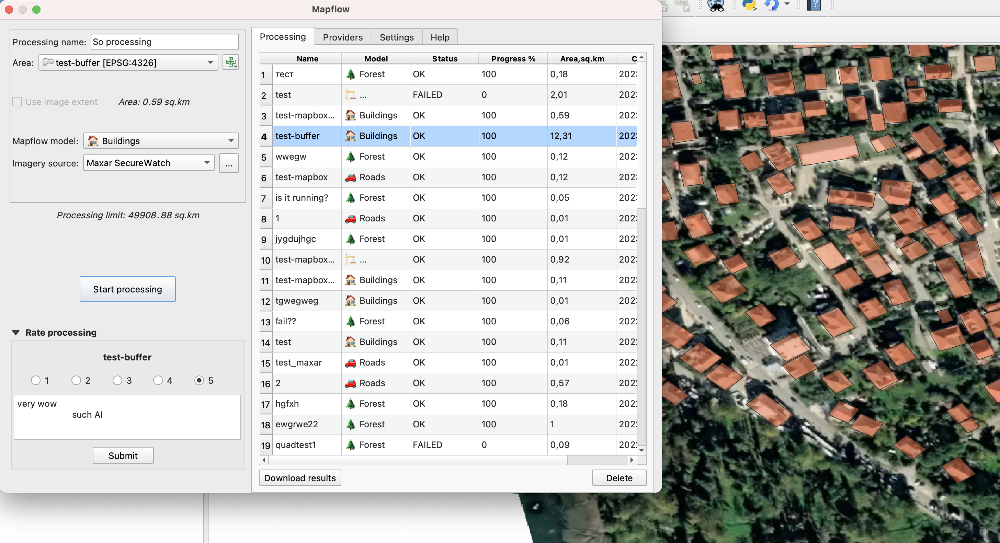

# Get maps from pixels with Mapflow by Geoalert

At [Geoalert](https://www.geoalert.io/en-US/), we employ Artificial Intelligence (AI) and Machine Learning (ML) to detect and extract real-world objects a.k.a. 'features' from satellite or aerial imagery.

You choose what type of features you want to extract, where and from which imagery, and [Mapflow](https://mapflow.ai/) will do the work for you.

Currently we can detect:
- building footprints (optionally, with height)
- forest (optionally, with height)
- construction sites
- roads

More info about our AI models can be found [here](https://docs.mapflow.ai/userguides/pipelines).

Mapflow supports various imagery sources types. You can upload your local GeoTIFF image, or use one of the tile services on the Web. By default, we use [Mapbox Satellite](https://www.mapbox.com/maps/satellite), but you can specify a link to another imagery in XYZ, WMS, etc. Among the providers, we have a special support for Maxar [SecureWatch](https://www.maxar.com/products/securewatch) service.

## Installation
The plugin can be found in the [official QGIS plugin repository](https://plugins.qgis.org/plugins/mapflow/) and can be installed by going to Plugins -> Manage and Install Plugins in QGIS, and then searching for 'Mapflow'. Make sure the 'all' tab is activated.

## Use

To learn how to use the plugin, please, follow our [guide](https://docs.mapflow.ai/api/qgis_mapflow).

## License

This software is released under the [GNU Public License (GPL)](LICENSE) Version 2 or any later version. This license means that you can inspect and modify the source code and guarantees that you always have access to this software under the same termas as QGIS, that is free of cost and can be freely modified.
